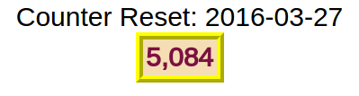

# Analysis and Tracking

---

## Doing Page Counting and Analysis

If you want to do page counting and analysis there are several MySql tables that you can use. The MySql schema for these tables is in the *mysql.schema* file in the repository.

The tables are:

* bots : the SiteClass has logic to try to determin which user agents might be robots. 
* bots2 : similar to bots but has a 'site' and 'date' field.
* logagent : logs the IpAddress, and User Agent.
* logagent2 : a short term version of lagagent.
* daycounts : counts the number of hits per day
* counter : counts the number of hits per site per file.
* counter2 : counts the number of hits per site per file per day.
* tracker : trackes accesses by site, page etc.

Here are the schemas of the tables:

```sql
CREATE TABLE `bots` (
  `ip` varchar(40) NOT NULL DEFAULT '',
  `agent` varchar(255) NOT NULL DEFAULT '',
  `count` int(11) DEFAULT NULL,
  `robots` int(5) DEFAULT '0',
  `who` varchar(255) DEFAULT NULL,
  `creation_time` datetime DEFAULT NULL,
  `lasttime` datetime DEFAULT NULL,
  PRIMARY KEY (`ip`,`agent`),
  KEY `ip` (`ip`)
) ENGINE=MyISAM DEFAULT CHARSET=utf8;

CREATE TABLE `bots2` (
  `ip` varchar(40) NOT NULL DEFAULT '',
  `agent` varchar(255) NOT NULL DEFAULT '',
  `date` date NOT NULL DEFAULT '0000-00-00',
  `site` varchar(50) NOT NULL DEFAULT '',
  `which` int(5) NOT NULL DEFAULT '0',
  `count` int(11) DEFAULT NULL,
  `lasttime` datetime DEFAULT NULL,
  PRIMARY KEY (`ip`,`agent`,`date`,`site`,`which`),
  KEY `ip` (`ip`),
  KEY `agent` (`agent`),
  KEY `site` (`site`),
  KEY `ip_2` (`ip`),
  KEY `date` (`date`),
  KEY `site_2` (`site`)
) ENGINE=InnoDB DEFAULT CHARSET=utf8;

CREATE TABLE `logagent` (
  `site` varchar(25) NOT NULL DEFAULT '',
  `ip` varchar(40) NOT NULL DEFAULT '',
  `agent` varchar(255) NOT NULL,
  `count` int(11) DEFAULT NULL,
  `id` int(11) DEFAULT NULL,
  `created` datetime DEFAULT '0000-00-00 00:00:00',
  `lasttime` datetime DEFAULT NULL,
  PRIMARY KEY (`site`,`ip`,`agent`),
  KEY `ip` (`ip`),
  KEY `site` (`site`),
  KEY `agent` (`agent`)
) ENGINE=MyISAM DEFAULT CHARSET=utf8;

CREATE TABLE `logagent2` (
  `site` varchar(25) NOT NULL DEFAULT '',
  `ip` varchar(40) NOT NULL DEFAULT '',
  `agent` varchar(255) NOT NULL,
  `count` int(11) DEFAULT NULL,
  `id` int(11) DEFAULT NULL,
  `created` datetime DEFAULT '0000-00-00 00:00:00',
  `lasttime` datetime DEFAULT NULL,
  PRIMARY KEY (`site`,`ip`,`agent`),
  KEY `agent` (`agent`),
  KEY `site` (`site`),
  KEY `ip` (`ip`)
) ENGINE=MyISAM DEFAULT CHARSET=utf8;

CREATE TABLE `daycounts` (
  `site` varchar(50) NOT NULL DEFAULT '',
  `date` date NOT NULL,
  `real` int(11) DEFAULT '0',
  `bots` int(11) DEFAULT '0',
  `members` int(11) DEFAULT '0',
  `visits` int(11) DEFAULT NULL,
  `lasttime` datetime DEFAULT NULL,
  PRIMARY KEY (`site`,`date`)
) ENGINE=MyISAM DEFAULT CHARSET=utf8;

CREATE TABLE `counter` (
  `filename` varchar(255) NOT NULL,
  `site` varchar(50) NOT NULL DEFAULT '',
  `ip` varchar(20) DEFAULT NULL,
  `agent` varchar(255) DEFAULT NULL,
  `count` int(11) DEFAULT NULL,
  `realcnt` int(11) DEFAULT '0',
  `lasttime` datetime DEFAULT NULL,
  PRIMARY KEY (`filename`,`site`),
  KEY `site` (`site`)
) ENGINE=MyISAM DEFAULT CHARSET=utf8;

CREATE TABLE `counter2` (
  `site` varchar(50) NOT NULL DEFAULT '',
  `date` date NOT NULL DEFAULT '0000-00-00',
  `filename` varchar(255) NOT NULL DEFAULT '',
  `count` int(11) DEFAULT '0',
  `members` int(11) DEFAULT '0',
  `bots` int(11) DEFAULT '0',
  `lasttime` datetime DEFAULT NULL,
  PRIMARY KEY (`site`,`date`,`filename`),
  KEY `site` (`site`),
  KEY `date` (`date`)
) ENGINE=MyISAM DEFAULT CHARSET=utf8;

CREATE TABLE `tracker` (
  `id` int(11) NOT NULL AUTO_INCREMENT,
  `site` varchar(25) DEFAULT NULL,
  `page` varchar(255) NOT NULL DEFAULT '',
  `ip` varchar(40) DEFAULT NULL,
  `agent` varchar(255) DEFAULT NULL,
  `starttime` datetime DEFAULT NULL,
  `endtime` datetime DEFAULT NULL,
  `difftime` time DEFAULT NULL,
  `refid` int(11) DEFAULT '0',
  `isJavaScript` int(5) DEFAULT '0',
  `lasttime` datetime DEFAULT NULL,
  PRIMARY KEY (`id`),
  KEY `site` (`site`),
  KEY `ip` (`ip`),
  KEY `agent` (`agent`)
) ENGINE=MyISAM DEFAULT CHARSET=utf8;
```

If you look at *SiteClass* you will see several methods in the constructor:

* $this->trackbots();
* $this->tracker();
* $this->doanalysis();
* $this->logagent();
* $this->counter();

If you look at these methods you will see that they are protected by a check of the database to see if the tables exists in the database. If the table does not exist an 'error_log' message is output. You can prevent the error message by setting "noErrorLog": "true" in the 'mysitemap.json' file.

## Additional Files for Tracking

I have five additional PHP files to check *robots.txt* (robots.php) and *Sitemap.xml* (sitemap.php). I also have a 'tracker.php', 'beacon.php' and 'tracker.js' to do session logging. These file are here in the 'docs/' directory.

If you want to track reads of *robots.txt* and *Sitemap.xml* you can add 'RewriteRule' clauses to your '.htaccess' file:

```bash
# direct robots.txt to robots.php and Sitemap.xml to sitemap.php
RewriteRule ^robots\.txt$ robots.php [L,NC]
RewriteRule ^Sitemap\.xml$ sitemap.php [L,NC]
```

If you want to do tracking you can include the 'tracker.js' file in the *php* head section in your 'head.i.php' file.

```php
<head>
  <!-- Other head stuff in the head.i.php file -->
  <!-- jQuery is required for tracker.js -->
  <script src="http://ajax.googleapis.com/ajax/libs/jquery/1/jquery.js"></script>
  <!-- set the 'lastId' variable to $this->LAST_ID. This is the 'id' key of the entry in the 'tracker' table -->
  <script>
var lastId = $this->LAST_ID;
  </script>
  <script src="js/tracker.js"></script>
  <!-- Other stuff -->
```

The 'tracker.js' will use AJAX to communicate with the 'tracker.php' and 'beacon.php' files. These files track the progress of the session and use 'unload' to capture the end of the session. Look at the two *php* files for more information. From the information in the MySql tables you could create a *php* file that could show the tracking information. I do this on my website so take a look at [www.bartonphillips.com](http://www.bartonphillips.com).

## Page Counting

If you want a page counter you can add '$counterWigget' to your 'footer.i.php' file. You can pass arguments via the `$S->getPageTopBottom($h, $b);` by passing a '$b' array. You can pass 'msg', 'msg1', 'msg2' and 'ctrmsg'. Or of course anything else you might want in your footer. The 'ctrmsg' is inserted just above the counter so you can add a reset message like "Counter Reset: 2016-03-27".

```php
return <<<EOF
<footer>
<!-- Other footer stuff like address, copyright etc. -->
{$arg['msg']}
{$arg['msg1']} 
$counterWigget
{$arg['msg2']}
</footer>
</body>
</html>
EOF;
```

The '$counterWigget' has *css* to render the counter. 

```css
/* Example CSS for the counterWigget */
/* #hitCounter is a div wrapper around the entire counter */
#hitCounter {
        margin-left: auto;
        margin-right: auto;
        width: 50%;
        text-align: center;
}
/* #hitCountertbl is the table that holds the counter */
#hitCountertbl {
        font-size: 1em;
        width: 0;
        border: 8px ridge yellow;
        margin-left: auto;
        margin-right: auto;
        background-color: #F5DEB3
}
/* #hitcountertr is the tr tag that holds the counter */
#hitCountertr {
        width: 0;
        border: 8px ridge yellow;
        margin-left: auto;
        margin-right: auto;
        background-color: #F5DEB3
}
/* #hitCounterth is the th tag that holds the counter */
#hitCounterth {
        color: rgb(123, 16, 66);
}
```

The above code created a centered table with a yellow 8 pixel ridge border, a light orangeish background and deep redish numbers. 



Using the above *css* you can create almost any type of counter you want. 

---

[Examples](examples.html)
[dbTables](dbTables.html)
[SiteClass Methods](siteclass.html)
[Additional Files](files.html)
[Analysis and Tracking](analysis.html)
[Testing](testing.html)
[Index](index.html)

## Contact Me

Barton Phillips : [bartonphillips@gmail.com](mailto://bartonphillips@gmail.com)  
Copyright &copy; 2015 Barton Phillips  
Project maintained by [bartonlp](https://github.com/bartonlp)
